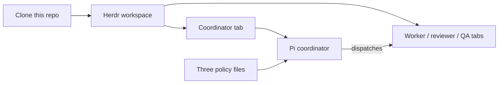

# Herdr + Pi coordinator

Declared version: **6.2-draft**. Identity is filename + declared version.

| File | Owns |
|---|---|
| `coordinator_standard.md` | protocol, authority, state, gates, recovery |
| `herdr_pi_runtime.md` | Herdr/Pi process, lock/CAS, GitHub publication |
| `routing_table.json` | routes, models, triggers |

## How to use

### Simple

1. Clone this repository, or download the three files above into one folder.
2. Open Pi.
3. Drag those three files into the Pi coordinator (or start Pi in that folder so it can read them from the working tree).
4. Paste the prompt at the bottom of this page.

### Recommended: Herdr workspace, Pi coordinator

Use this when you want visible process topology. The coordinator is **Pi**. Workers live in other Herdr tabs.



```text
Herdr workspace
├── Tab: coordinator  →  Pi   (reads the three files, does not implement)
├── Tab: worker
├── Tab: reviewer
└── Tab: QA shell
```

In a terminal:

```bash
git clone https://github.com/minqiyang/herdr-pi-coordinator.git
cd herdr-pi-coordinator
herdr workspace create --cwd "$PWD" --label coordinator
```

The create response includes `root_pane.pane_id`. Start Pi in that pane:

```bash
herdr agent start coord --kind pi --pane <root_pane_id>
```

Keep the coordinator alone in that tab. Independent work goes in a **new tab**, not a split of the coordinator tab. Then paste the prompt below into Pi.

## Prompt to paste into Pi

New projects and existing projects use the same text. Copy the whole block.

```text
Read these three files. They are the only policy. Declared version: 6.2-draft.

coordinator_standard.md
herdr_pi_runtime.md
routing_table.json

Do not take gate rules from any other skill. Do not rewrite routing.

Then:
- No project-binding event → PROJECT_INITIALIZED, then the smallest authorized card.
- Binding exists but not 6.2-draft → recover event head and epoch, PROJECT_RECONFIGURED, do not rewrite in-flight attempts, then the next authorized transition.
- Already bound to 6.2-draft → recover, then COORD-02. HOLD per ADV-01 if the next step is not authorized.
```

Use the filenames as they appear in the clone. Do not replace them with machine-specific absolute paths.
